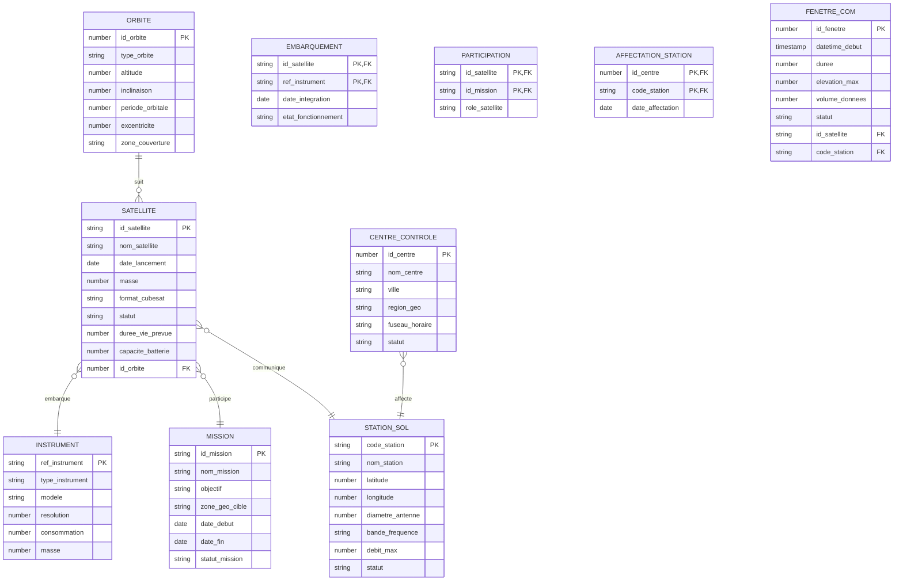

# Livrable L1-B : Modèle Conceptuel de Données (MCD)

## Étape 3 : Construction du MCD MERISE

### Entités Identifiées

Le MCD comprend les entités suivantes, extraites du dictionnaire et des données :

- **ORBITE** : Caractéristiques des orbites spatiales
- **SATELLITE** : Satellites NanoOrbit
- **INSTRUMENT** : Instruments embarqués
- **CENTRE_CONTROLE** : Centres de contrôle opérationnel
- **STATION_SOL** : Stations de réception au sol
- **MISSION** : Missions spatiales
- **EMBARQUEMENT** : Association satellite-instrument (avec attributs)
- **PARTICIPATION** : Association satellite-mission (avec attributs)
- **AFFECTATION_STATION** : Association centre-station
- **FENETRE_COM** : Association satellite-station pour communications

### Associations et Cardinalités

#### Associations Binaires

1. **suit** (SATELLITE → ORBITE)
   - Cardinalité : N-1
   - Un satellite suit une seule orbite, une orbite peut être suivie par plusieurs satellites

2. **embarque** (SATELLITE ↔ INSTRUMENT via EMBARQUEMENT)
   - Cardinalité : N-M
   - Un satellite embarque plusieurs instruments, un instrument peut être embarqué sur plusieurs satellites
   - **Attributs de l'association** : date_integration, etat_fonctionnement

3. **participe** (SATELLITE ↔ MISSION via PARTICIPATION)
   - Cardinalité : N-M
   - Un satellite participe à plusieurs missions, une mission implique plusieurs satellites
   - **Attributs de l'association** : role_satellite

4. **affecte** (CENTRE_CONTROLE ↔ STATION_SOL via AFFECTATION_STATION)
   - Cardinalité : N-M
   - Un centre contrôle plusieurs stations, une station peut être affectée à plusieurs centres
   - **Attributs de l'association** : date_affectation

5. **communique** (SATELLITE ↔ STATION_SOL via FENETRE_COM)
   - Cardinalité : N-M
   - Un satellite communique avec plusieurs stations, une station communique avec plusieurs satellites
   - **Attributs de l'association** : datetime_debut, duree, elevation_max, volume_donnees, statut

### Attributs par Entité

Voir le diagramme Mermaid ci-dessous pour la visualisation complète.

### Diagramme MCD

### Points Critiques Respectés

- ✅ **EMBARQUEMENT** : Modélisé comme association avec attributs (date_integration, etat_fonctionnement)
- ✅ **PARTICIPATION** : Association avec attribut (role_satellite)
- ✅ **FENETRE_COM** : Relation entre satellite et station sol
- ✅ **CENTRE_CONTROLE ↔ STATION_SOL** : Association via AFFECTATION_STATION

### Validation du MCD

- **Normalisation** : Toutes les entités sont en 1NF (attributs atomiques)
- **Dépendances** : Les FK sont correctement identifiées
- **Cardinalités** : Basées sur l'analyse des données CSV
- **Cohérence** : Le modèle couvre tous les cas d'usage identifiés</content>
<parameter name="filePath">/Users/louis.maury/Documents/EFREI/M1 - EFREI/BDD reparties/academy-nanoorbit-project/L1-B_MCD.md